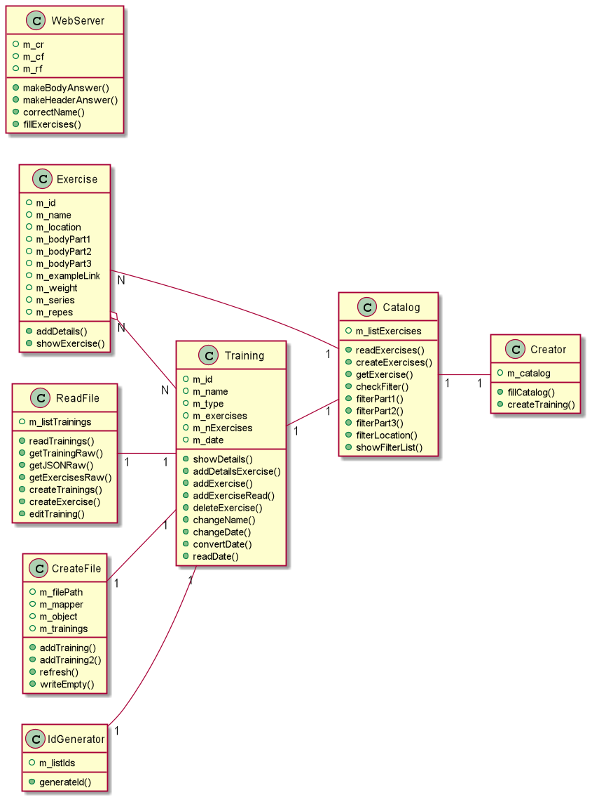

# Smart Trainer - backend

### Treball de final de Grau (TFG) - Víctor González Escribá

En aquest repositori s'ha desenvolupat el backend de l'aplcació utilitzant Java. També s'han testejat les diferents
classes utilitzant proves de caixa negra.

## Resum
En aquest projecte s’ha desenvolupat una aplicació mòbil multiplataforma amb Java i Flutter per a crear i gestionar
entrenaments per fer tant a casa com al gimnàs. L’aplicació permet a l’usuari crear entrenaments manualment a partir
d’exercicis que l’aplicació conté o crear un entrenament automàticament per part de l’aplicació, seleccionant entre diferents
opcions, com la localització on es vol fer l’entrenament. També disposa d’ una vista d’un calendari on podem veure els
entrenaments assignats segons el dia de la setmana A més, l’usuari podrà compartir els entrenaments que vulgui amb altres
usuaris per mitjà d’un codi que es genera automàticament.

## Abstract
For this project, a multiplatform mobile application created using Java and Flutter has been developed to elaborate
and manage workouts to do either at home or at the gym. The application allows the user to create trainings manually from the
exercise list that the application already contains. However, it also allows to automatically create a training selecting between
different options such as the location where the user will do the workout, the purpose of the training, and so on. The application
offers a built-in calendar, where the user can see the training session assigned according to the corresponding day of the week.
In addition, the user will be able to share their trainings, if they wish to do so, to other users via an automatically generated code.

A continuació es mostra el diagrama de classes desenvolupat:

